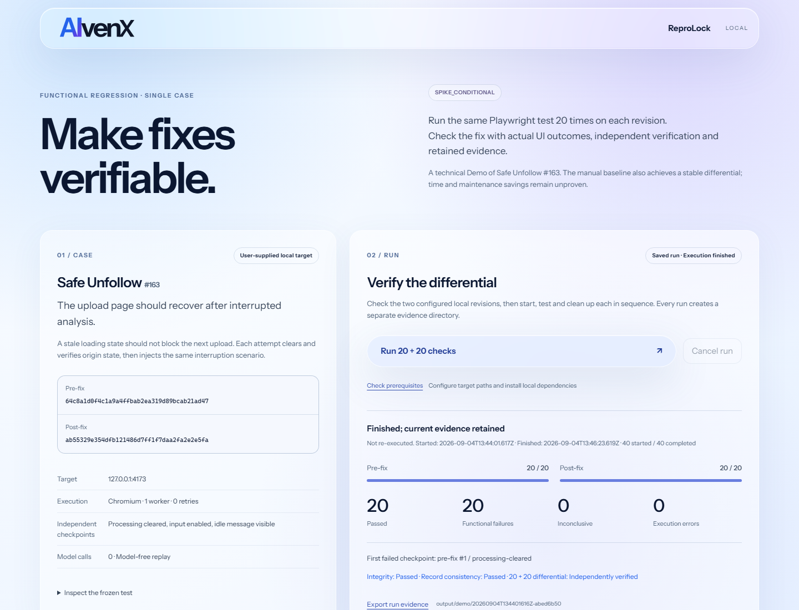

<p align="center">
  
  <br>
  <sub>FUNCTIONAL REGRESSION EVIDENCE</sub>
</p>

# ReproLock

[](https://github.com/AlbertXXuu/ReproLock/actions/workflows/ci.yml)
[](LICENSE)

**Prove that a reviewed Playwright regression test fails before a fix and passes after it.**

ReproLock runs one ordinary Playwright candidate against two exact local Git worktrees, classifies
only observed business assertions, checks cleanup and target identity, and writes a portable bundle
whose differential result can be recomputed without a model call.

The repository is an **experimental source alpha** and the product decision remains
**`SPIKE_CONDITIONAL`**. It does not turn issue prose into a finished test, sandbox untrusted code,
publish an npm package, or claim that it saves more effort than writing Playwright directly.

## Check the evidence in two minutes

This path verifies the checked-in DrawDB result. It does not rerun DrawDB or require a browser.

```bash
git clone https://github.com/AlbertXXuu/ReproLock.git
cd ReproLock
corepack pnpm install --frozen-lockfile
corepack pnpm quickstart
```

The command exits 0 only when the portable bundle still proves the complete pre-fix failure /
post-fix pass differential. Try changing a copied field such as a revision, exit code, observation,
fingerprint or hash; `reprolock verify` must reject the contradiction.

## Use it on a supplied local regression

Prepare two clean worktrees from the same repository: one at the known pre-fix commit and one at the
known post-fix commit. Install each target with its own trusted locked command. ReproLock never
discovers or executes setup commands from issue text or repository prose.

Run each target's reviewed, lockfile-backed build command first. The example below assumes both
worktrees now contain `dist` and uses Vite's preview server. Create a small issue text file, then
scaffold a case workspace outside both targets:

```bash
corepack pnpm reprolock init ../my-reprolock-case \
  --issue ../issue.txt \
  --pre ../app-pre \
  --post ../app-post \
  --start-node node_modules/vite/bin/vite.js \
  --start-arg preview \
  --start-arg --host \
  --start-arg 127.0.0.1 \
  --start-arg --port \
  --start-arg 4173 \
  --start-arg --strictPort \
  --served-path dist \
  --origin http://127.0.0.1:4173
```

`init` copies the issue and optional `--workflow` file into the ignored `inputs/` directory as
inert data. It resolves the two Git revisions and creates:

- `candidate.spec.ts`, an intentionally incomplete ordinary Playwright scaffold;
- `reprolock.local.json`, a local explicit execution configuration;
- `inputs/manifest.json`, with byte counts and SHA-256 hashes but no source paths; and
- a case README with the review sequence.

It does not interpret the issue, infer a reset, choose an oracle, or generate executable actions.
Read the inputs, review and complete the candidate, remove every `REPROLOCK_TODO`, and replace the
reset description in the local configuration. Then run:

```bash
corepack pnpm exec playwright install chromium
corepack pnpm reprolock check ../my-reprolock-case/reprolock.local.json
corepack pnpm reprolock run ../my-reprolock-case/reprolock.local.json
corepack pnpm reprolock verify ../my-reprolock-case/runs/run-REPLACE/export.json
```

`check` reports the exact revisions and fingerprints without starting either application. `run`
prints its real evidence directory, status, diagnostic and derived outcomes. Exit 0 means the
requested differential was confirmed; 2 means it was not confirmed, 124 is a deadline, and 130 is
cancellation. See the [complete candidate and configuration contract](docs/local-verification.md).

## What ReproLock adds to Playwright

Playwright executes browser tests. ReproLock keeps that test standalone and adds a narrow proof
protocol around it:

| Boundary | Current alpha behavior |
| --- | --- |
| Source identity | Requires two clean worktrees with ordinary tracked-index state (no hidden or sparse entries), full revisions, a committed package manifest and lockfile, and hashes the installed Node start entry. |
| Ignored build output | `servedPaths` hashes a bounded, complete file tree such as `dist` before and after execution. Symlinks and special files are rejected. |
| Reset | Requires one explicit `reset` step with an observed passing assertion. A fresh context alone is not accepted as application reset. |
| Outcome | V1 accepts one direct scalar `toBe` assertion inside one later `outcome` step. Operational and unrelated errors are `inconclusive`. |
| Differential | The same candidate and assertion callsite must fail functionally on pre-fix and pass on post-fix for every declared repetition. |
| Runtime | Uses one worker, zero retries, loopback HTTP, bounded deadlines, restricted child environments, and observed process cleanup. |
| Evidence | Canonical hashes bind settings, runtime sources, target fingerprints, reports and attempts; verification recomputes the gate. |

Portable evidence establishes internal consistency, not who executed the run. The candidate source
is included so reviewers can inspect and run it without ReproLock.

## Trust and safety boundary

The candidate and both target worktrees are **trusted executable code**. ReproLock's import checks,
restricted environment and browser-origin guard reduce accidental scope; they are not an OS sandbox.
Do not run code copied from an issue, recorder, model or contributor until you have reviewed it as
code you are willing to execute under your own account. Custom browser launches, Node networking
and process APIs can escape the browser fixture guard.

The supported contract requires the target to bind only to loopback; standard Playwright fixtures
are guarded to the exact configured origin. Portable exports omit configuration paths, raw start
arguments, input prose, page bodies and process output. Local run metadata stores hashes and sizes
instead of raw stdout/stderr, and general runs disable Playwright failure snapshots. The candidate
itself can still contain private values, so inspect it and the export before sharing. Read the
[security policy](SECURITY.md) and use the
[private report channel](https://github.com/AlbertXXuu/ReproLock/security/advisories/new) for a
vulnerability.

## Evidence so far

| Case | ReproLock result | Honest control and limitation |
| --- | --- | --- |
| Safe Unfollow #163 | 20/20 expected pre-fix failures and 20/20 post-fix passes, revalidated on 2026-09-04. | The manual/recorder baseline reached the same differential and action count. This highly structured case did not prove incremental value. |
| DrawDB #687 | 20/20 pre-fix functional failures and 20/20 post-fix passes. Its frozen historical inventory separately binds all 28 served build files. | Ordinary Playwright also achieved 20/20 + 20/20. The candidate used known issue/PR hints, so authoring and maintenance benefit remain unmeasured. |

Inspect the [Safe Unfollow Spike report](spikes/local-functional-regression/SPIKE_REPORT.md), its
[dated revalidation](spikes/local-functional-regression/revalidation/2026-09-04/execution.json),
and the [DrawDB #687 report](spikes/local-candidate-verification/drawdb-687/REPORT.md). Repetitions
show stability for these exact cases; they do not establish general reliability.

## Safe Unfollow reference evidence UI

The local UI is a fixed reference case and historical evidence viewer, not the general CLI. After
preparing the two Safe Unfollow worktrees described in [the Demo guide](docs/demo.md), run:

```bash
corepack pnpm demo --config demo.local.json
```

Open **http://127.0.0.1:7872**. You can inspect the frozen standalone test, saved evidence and a real
20+20 rerun. New evidence is stored under `output/demo/`; raw process output is not persisted by
default. The UI remains English to match the other AlvenX project interfaces.



The screenshot shows the saved 2026-09-04 run. It is not evidence of a new execution.

## Development

Node.js 24.20.0 is the primary runtime and 22.23.2 is the minimum. pnpm 11.19.0 is pinned. If your
shell cannot find `pnpm`, use `corepack pnpm` as shown below; no global pnpm install is required.

```bash
corepack pnpm install --frozen-lockfile
corepack pnpm exec playwright install chromium
corepack pnpm check
corepack pnpm package:smoke
```

`pnpm check` runs formatting, lint, brand validation, TypeScript, unit/process and browser tests,
and every checked-in evidence verifier. CI repeats the accepted checks on Node 22.23.2 and 24.20.0.
The package smoke checks a private source archive; installability and publication are intentionally
not claimed.

The main implementation lives in `src/verify/`; `src/demo/` is the bounded reference UI;
`spikes/` preserves case evidence; and `plans/` plus `harness/context/` preserve decisions and
actual acceptance commands. Read the [project charter](PROJECT_CHARTER.md),
[architecture baseline](reference/ARCHITECTURE_AND_ACCEPTANCE_BASELINE.md) and
[contribution guide](CONTRIBUTING.md) before expanding scope.

## Project gate

Public source and passing CI do not grant product `GO`. The next gate is one outside maintainer,
without author assistance, completing `init → review → check → run → verify`, keeping the standalone
test or CI integration, and providing feedback that changes the product contract. Until then, do
not claim automatic generation, saved developer time, lower maintenance cost or production support.

ReproLock code is licensed under [Apache-2.0](LICENSE). Instrument Sans is distributed under the
[SIL Open Font License 1.1](docs/assets/InstrumentSans-OFL.txt); see
[third-party notices](THIRD_PARTY_NOTICES.md). The AlvenX and ReproLock names and visual marks have
separate [brand-use terms](TRADEMARKS.md).
